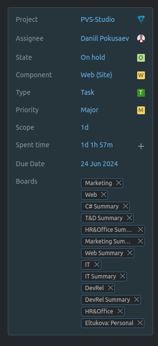
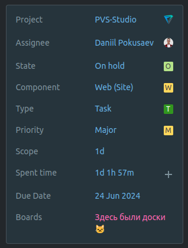

# Плагин для Chrome, немного фиксящий YouTrack

## Текущий функционал

1. Убирает раздел "доски" в задачах

2. Заменяет красные опасные теги "Overdue" на что-то более приятное глазу

## Установка

1. Скачать архив с плагином (справа сверху зеленая кнопка "Code")
2. Распаковать плагин в удобное для себя место
3. Зайти в [плагины хрома](chrome://extensions/)
4. Включить режим разработчика (переключатель "Developer mode" справа сверху), нажать "Load unpacked" (кнопка слева сверху), выбрать папку с плагином

## Обновления

К сожалению, чтобы попасть в магазин Google Chrome, надо оплатить 5$ нероссийской картой, 
а я не настолько сильно горю желанием, чтобы это дело как-то обходить.

Варианты:

1. Ручками перекачать архив с плагином, затем обновить его на [панели расширений](chrome://extensions/) Chrome
2. git pull